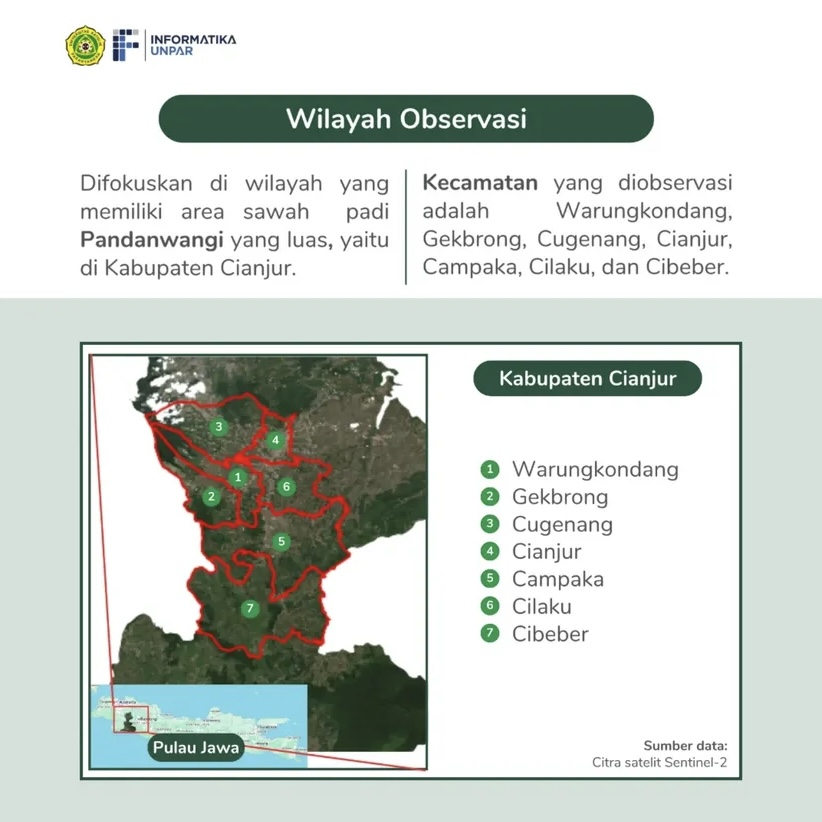
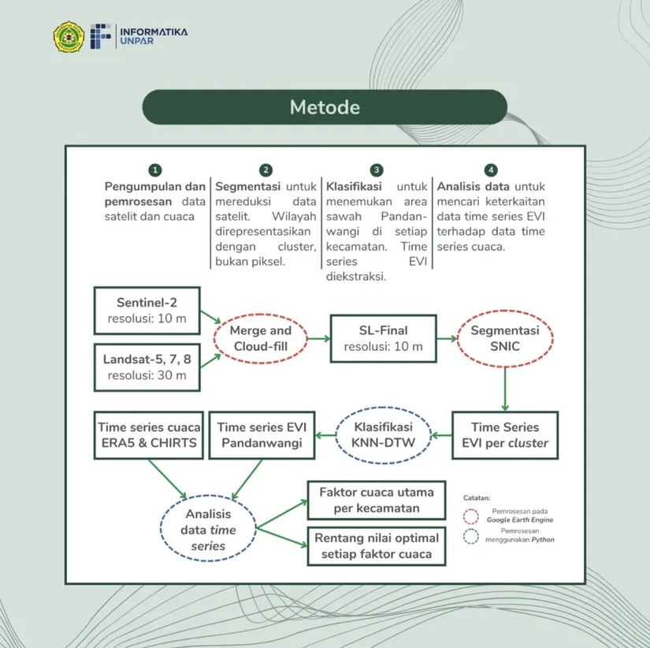
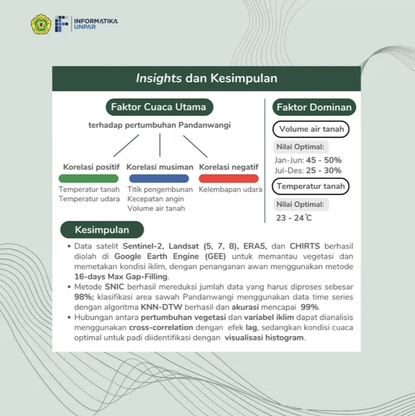

# Vegetation-Climate Project

## Project Title
HISTORICAL SATELLITE DATA ANALYSIS TO MONITOR VEGETATION RELATED TO CLIMATE CHANGE

## Overview
The **Vegetation-Climate** project aims to analyze the relationship between vegetation growth and climatic changes, focusing on how variations in climate impact different types of vegetation. The project involves collecting and analyzing historical satellite data and using machine learning models to classify vegetation area based on time series data.

## Objectives
- **Analyze the correlation of climate change and vegetation**: Study how climatic variables like temperature, rainfall, and humidity correlated to the growth of the vegetation overtime.
- **Support sustainable agriculture**: Provide insights for optimal value range for the climate factors, which can be utilized by local and regional authorities as well as farmers.

## Data Sources
- **Sentinel and Landsat Satellite Data**: Using Sentinel-2, Landsat-5,7, and 8 to monitor vegetation growth.
- **Weather Data**: Collected from various sources, ERA5, CHIRTS, MERRA-2 (NASA POWER) to track climate factors from each observation area.
- **Ground-Truth Data**: Collected from field study and local authorities for validation purposes.

## Observation Area
The currently observed vegetation, **Padi Pandanwangi**, is mainly located in 7 different locations in Kabupaten Cianjur:
- Kecamatan Warungkondang
- Kecamatan Gekbrong
- Kecamatan Cugenang
- Kecamatan Cianjur
- Kecamatan Campaka
- Kecamatan Cilaku
- Kecamatan Cibeber



## Method Used
The satellites raw data from Landsat and Sentinel are merged to produce a gap-filled time series EVI from 1983 to 2025. A clear image from 2020 is then clustered using SNIC algorithm with each cluster sized approximately 81 pixels (10m spatial resolution). Mean EVI from each clusters are then extracted temporally. After that, a machine learning model, KNN-DTW (K-Nearest Neighbour - Dynamic Time Warping), is conducted to classify vegetation type from each clusters.

The training data is collected by field visitation in Kecamatan Warungkondang. Around 40ha area are labelled as 'Padi Pandanwangi', and 40ha labelled as 'non-Pandanwangi'. Using KNN-DTW model with several iterations (parameter tuning), an accuracy of 99% has successfully been reached to separate the two classes. Each clusters from each locations are then classified to define areas that related to the vegetation.

Time series EVI from each locations are then extracted and mapped to the growth of the vegetation. Now, having two time series data, the vegetation growth index and climate factors, cross-correlation is used to find a connection between the climate factors and the vegetation growth, considering lag from each planting cycle. The methods and result are shown below.





## Program Manual

### 1. Environment Setup
Optional: Configure virtual env for this project

If you use Python:

```bash
python -m venv
source venv/bin/activate
pip install -r requirements.txt
```

If you use Conda:
```bash
conda create -n venv_name
conda activate venv_name
conda install --yes --file requirements.txt
```
### 2. Run Notebooks

To run programs through jupyter, you can run this:
```bash
jupyter lab
```

Classification models can be accessed and tuned on:
- sawah_classification.ipynb
- padi_classification.ipynb


### 3. Running GUI

To run frontend GUI through streamlit, run this:
```bash
streamlit run frontend/main.py
```

### 4. Google Earth Engine projects 

All the GEE Projects links could be accessed from gee.txt